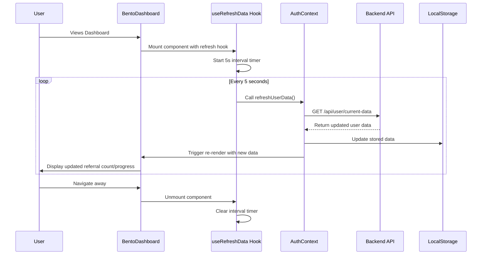

# Design Document: Referral Data Refresh

## Overview

The referral data refresh feature will implement automatic polling of user data from the backend API every 5 seconds while users are viewing the BentoDashboard. This will ensure that referral counts, queue positions, and Pro membership progress are displayed in real-time without requiring users to log out and log back in.

The solution involves creating a new backend API endpoint for fetching current user data, implementing a React hook for managing the refresh interval, and updating the AuthContext to support data refreshing while maintaining the existing authentication flow.

## Architecture

### High-Level Flow



### Component Architecture

The refresh functionality will be implemented across three layers:

1. **Backend API Layer**: New endpoint `/api/user/current-data` to fetch fresh user data
2. **Service Layer**: Enhanced AuthContext with real-time data refresh capabilities
3. **UI Layer**: Custom React hook `useRefreshData` for managing refresh intervals

## Components and Interfaces

### Backend API Enhancement

**New Endpoint**: `GET /api/user/current-data`

```typescript
interface CurrentUserDataRequest {
  email: string;
}

interface CurrentUserDataResponse {
  ok: boolean;
  data?: {
    referralCode: string;
    referralCount: number;
    waitlistPosition: number;
  };
  error?: string;
}
```

The endpoint will:

- Accept user email as a query parameter or in request body
- Return the same data structure as the OTP verification endpoint
- Handle authentication errors gracefully
- Be optimized for frequent polling (lightweight response)

### Frontend Service Layer

**Enhanced AuthContext**

The existing `AuthContext` will be extended with a new `refreshUserData` method:

```typescript
interface AuthContextType {
  // ... existing properties
  refreshData: () => Promise<void>;
  lastRefreshTime: number | null;
  refreshError: string | null;
}
```

**New Backend API Service Method**

```typescript
// In backendApi.ts
export const getCurrentUserData = async (
  email: string,
): Promise<BackendUserData> => {
  const response = await fetch(`${API_CONFIG.BASE_URL}/api/user/current-data`, {
    method: "POST",
    headers: { "Content-Type": "application/json" },
    body: JSON.stringify({ email }),
  });

  if (!response.ok) {
    throw new Error("Failed to fetch current user data");
  }

  const result = await response.json();
  return result.data;
};
```

### UI Layer Components

**Custom Hook: useRefreshData**

```typescript
interface UseRefreshDataOptions {
  enabled: boolean;
  interval: number; // milliseconds
  onError?: (error: Error) => void;
}

interface UseRefreshDataReturn {
  isRefreshing: boolean;
  lastRefreshTime: number | null;
  error: string | null;
}

const useRefreshData = (
  options: UseRefreshDataOptions,
): UseRefreshDataReturn => {
  // Implementation details in tasks
};
```

**Enhanced BentoDashboard Component**

The BentoDashboard will use the refresh hook:

```typescript
export default function BentoDashboard({
  queuePosition,
  totalUsers,
  referralStats,
  referralCode,
}: BentoDashboardProps) {
  // Enable refresh when component is mounted
  const { isRefreshing, error } = useRefreshData({
    enabled: true,
    interval: 5000, // 5 seconds
    onError: (error) => console.error("Refresh failed:", error),
  });

  // ... rest of component remains unchanged
}
```

## Data Models

### Existing Data Models (No Changes Required)

The current data models in `AuthContext.tsx` will remain unchanged:

```typescript
export interface BackendUserData {
  referralCode: string;
  referralCount: number;
  waitlistPosition: number;
}

export interface User {
  email: string;
  referralCode: string;
  referralCount: number;
  waitlistPosition: number;
}

export interface ReferralStats {
  code: string;
  count: number;
  users: Array<{
    email: string;
    joinedAt: number;
  }>;
}
```

### New Data Models

**Refresh State Management**

```typescript
interface RefreshState {
  isRefreshing: boolean;
  lastRefreshTime: number | null;
  error: string | null;
  consecutiveFailures: number;
}
```

## Correctness Properties

_A property is a characteristic or behavior that should hold true across all valid executions of a system-essentially, a formal statement about what the system should do. Properties serve as the bridge between human-readable specifications and machine-verifiable correctness guarantees._

### Converting EARS to Properties

Based on the prework analysis, I'll convert the testable acceptance criteria into universally quantified properties:

**Property 1: Automatic refresh interval behavior**
_For any_ user viewing the BentoDashboard, the system should automatically make API calls to fetch referral data at 5-second intervals, and when the component unmounts, all intervals should be properly cleaned up to prevent memory leaks.
**Validates: Requirements 1.1, 1.5, 4.1**

**Property 2: Data update propagation**
_For any_ updated referral data received from the backend, the system should immediately update all displayed referral counts, progress indicators, and Pro membership progress bars to reflect the new values.
**Validates: Requirements 1.2, 1.3, 5.2**

**Property 3: API response format consistency**
_For any_ valid user email provided to the current user data endpoint, the backend should return data in the same structure as the OTP verification response, including referralCode, referralCount, and waitlistPosition fields.
**Validates: Requirements 2.1, 2.3**

**Property 4: Invalid input error handling**
_For any_ invalid email format provided to the backend API, the system should return an appropriate error response without causing system failures.
**Validates: Requirements 2.2**

**Property 5: Concurrent request handling**
_For any_ set of simultaneous refresh requests made to the backend, the system should handle them efficiently without data corruption or race conditions.
**Validates: Requirements 2.4**

**Property 6: Error resilience and state preservation**
_For any_ network error or backend error during data refresh, the system should maintain the last known valid data in the UI, log errors appropriately, and continue attempting refreshes at the next interval.
**Validates: Requirements 3.1, 3.2, 1.4**

**Property 7: Retry behavior consistency**
_For any_ sequence of consecutive refresh failures, the system should continue attempting refreshes at the same 5-second interval without implementing exponential backoff.
**Validates: Requirements 3.3**

**Property 8: Session invalidation handling**
_For any_ authentication error during refresh (indicating invalid session), the system should handle the error gracefully and redirect to login when necessary.
**Validates: Requirements 3.4**

## Error Handling

### Network Error Scenarios

1. **Connection Timeout**: Continue with last known data, retry on next interval
2. **Server Unavailable (5xx)**: Log error, maintain UI state, continue retrying
3. **Client Errors (4xx)**: Log error, handle authentication issues, maintain UI state
4. **Network Disconnection**: Graceful degradation, resume when connection restored

### Backend Error Responses

The system will handle various backend error scenarios:

```typescript
interface ErrorResponse {
  ok: false;
  error: string;
  code?:
    | "INVALID_EMAIL"
    | "USER_NOT_FOUND"
    | "SESSION_EXPIRED"
    | "SERVER_ERROR";
}
```

### Error Recovery Strategy

- **Transient Errors**: Continue retrying without user notification
- **Authentication Errors**: Clear session and redirect to login
- **Persistent Errors**: Log for debugging but maintain user experience
- **Rate Limiting**: Respect backend rate limits (if implemented)

## Testing Strategy

### Dual Testing Approach

The implementation will use both unit tests and property-based tests to ensure comprehensive coverage:

**Unit Tests** will verify:

- Specific examples of API responses and UI updates
- Edge cases like component mounting/unmounting
- Error conditions and recovery scenarios
- Integration points between components

**Property-Based Tests** will verify:

- Universal properties across all inputs using randomized data
- Comprehensive input coverage through automated generation
- System behavior under various conditions and timing scenarios

### Property-Based Testing Configuration

- **Testing Library**: React Testing Library with Jest for property-based testing
- **Minimum Iterations**: 100 iterations per property test
- **Test Tags**: Each property test will reference its design document property
- **Tag Format**: **Feature: referral-data-refresh, Property {number}: {property_text}**

### Testing Focus Areas

**Interval Management Testing**:

- Verify 5-second intervals are maintained accurately
- Test cleanup on component unmount
- Validate single interval per user session

**Data Flow Testing**:

- Test API call → data update → UI refresh pipeline
- Verify data transformation and storage
- Test concurrent update scenarios

**Error Handling Testing**:

- Simulate various network and backend errors
- Verify graceful degradation and recovery
- Test authentication error scenarios

**Performance Testing**:

- Verify no memory leaks from intervals
- Test performance impact of frequent updates
- Validate smooth user interactions during refresh

### Mock Strategy

Tests will use minimal mocking to validate real functionality:

- Mock only external dependencies (fetch API, timers)
- Use real React components and state management
- Avoid mocking business logic or data transformations
- Focus on testing actual user-facing behavior

The testing approach ensures both specific examples work correctly (unit tests) and universal properties hold across all inputs (property tests), providing comprehensive validation of the referral data refresh functionality.
